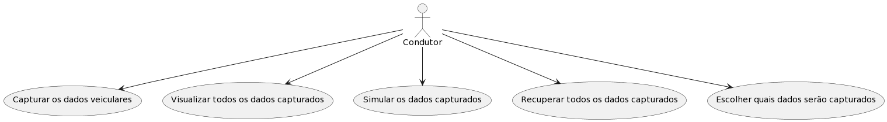

A implementação dos aplicativo mobile, utiliza o framework Flutter, que por sua vez utiliza a linguagem de programação Dart, a qual é orientada a objetos, baseada em classes e possui uma sintaxe similar à linguagem C. Inicialmente, o aplicativo foi concebido para coletar exclusivamente informações da interface OBD e armazená-las em um banco de dados Firebase. Firebase é um conjunto de serviços de back-end de computação em nuvem e plataformas de desenvolvimento de aplicativos fornecidos pelo Google. Dart, Flutter e Firebase foram desenvolvidos pela empresa Google LLC. Entretanto, o Firebase apresentou algumas limitações em termos de quantidade de leitura e escrita de informações.

Os testes iniciais revelaram que, para um volume significativo de informações, o experimento poderia ser prejudicado, pois quando o limite de operações permitidas é atingido, o banco de dados bloqueia as operações, as quais só podem ser recuperadas após um determinado período de tempo. Como a plataforma blockchain ainda está em desenvolvimento, foi decidido utilizar bibliotecas e plugins que auxiliem no armazenamento de dados internos do aplicativo. Inicialmente, realizamos a modelagem dos dados que serão recebidos. 

A Figura 1 ilustra a divisão dos casos de uso. A primeira etapa para capturar os dados veiculares envolve a conexão com o OBD é um dispositivo móvel via Bluetooth. Inicialmente, o condutor precisa conectar o scanner à interface do veículo e ligar o veículo para estabelecer a conexão e adquirir as informações necessárias. A segunda ação que um condutor pode realizar é visualizar os dados capturados pela aplicação em seu dispositivo. Para o armazenamento de dados, foi inicialmente utilizado um banco de dados chamado HiveDB, onde todos os dados são organizados em "caixas". Uma caixa pode ser comparada a uma tabela em SQL, mas não possui uma estrutura rígida e pode conter qualquer tipo de dado.

A terceira ação consiste em simular aleatoriamente os comandos que o OBD pode enviar, seguindo as normas estabelecidas para a quantidade mínima e máxima de comandos que o OBD pode transmitir. A quarta ação envolve a recuperação das informações armazenadas, inicialmente utilizando o formato JavaScript Object Notation (JSON). O JSON é um formato de arquivo de padrão aberto utilizado para armazenar e transmitir objetos de dados que consistem em pares de atributo-valor e matrizes. Esses arquivos são salvos na pasta do projeto e podem ser acessados pelo desenvolvedor que deseja recuperar as rotas geradas pelo aplicativo

Figura 1: Ações do usuário no sistema Mobile

A Figura 2 representa a interação do condutor com o aplicativo. O processo começa quando o condutor solicita que o aplicativo inicie o experimento. Neste momento, o aplicativo  inicia uma solicitação de conexão Bluetooth com o scanner OBD. O scanner, por sua vez, solicita as informações à interface OBD do veículo, que envia esses dados ao aplicativo através do scanner

Figura 2: Ações do usuário no sistema aplicativo mobile

